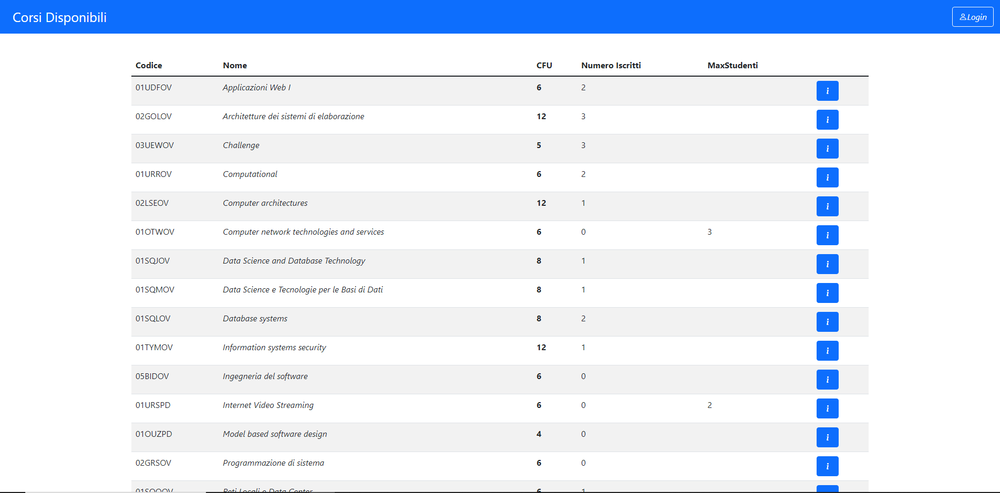
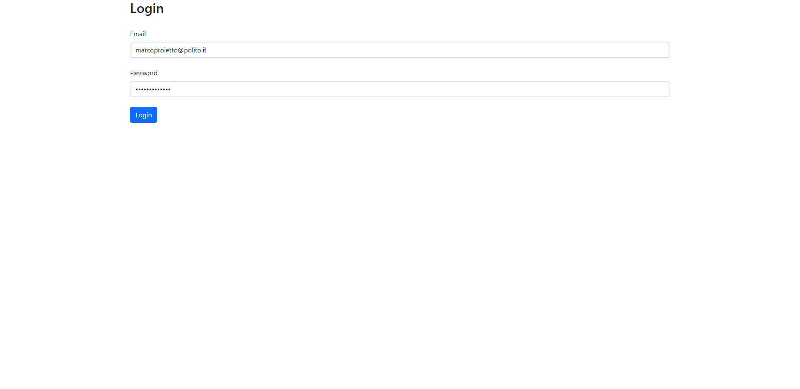
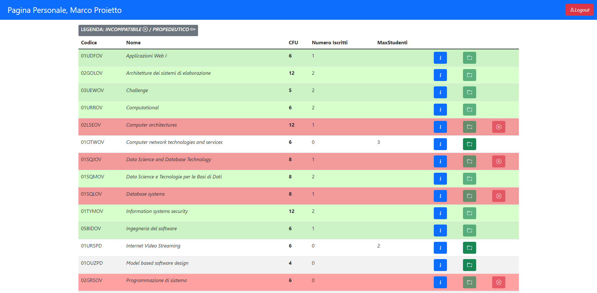
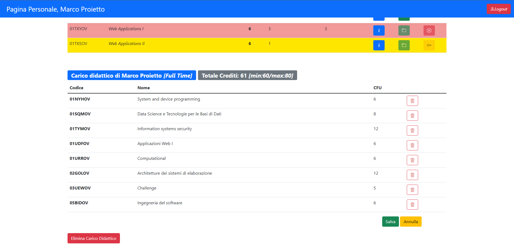

# Exam #1: "Piano Di Studi"
## Student: s295671 PROIETTO MARCO 

## React Client Application Routes

- Route `/`: pagina principale contenente tutti i corsi messi a disposizione con le relative informazioni, con le relative informazioni aggiuntive di propedeuticità e incompatibilità
- Route `/login`: pagina contenente il form da compilare per effettuare l'accesso 
- Route `/loggato`: pagina contenente la tabella dei corsi e la tabella personale dell'utente loggato, con i rispettivi esami immessi nel carico didattico (se presenti)

## API Server

- POST `/api/sessions`
  - request body content: credenziali di accesso (username, password)
  - response body content: Informazioni relative all'utente loggato
- GET `/api/courses`
  - request body content: None
  - response body content: Lista di tutti i corsi presenti nel database con le relative informazioni
- GET `/api/personlexams`
  - request body content: None
  - response body content: Lista degli esami attualmente presenti nel carico didattico dell'utente loggato, con le relative informazioni
- DELETE `/api/deletecareer`
  - request body content: Id dello studente
  - response body content: This.changes/Messaggio di errore
- PUT `/api/add`
  - request body content: Lista degli esami da aggiungere nel Carico Didattico e un numero intero (0/1) che indica rispettivamente la scelta del FULL TIME e del PART TIME,
  - response body content: True/Messaggio di errore
- DELETE `/api/sessions/current`
  - request body content: credenziali di accesso (username, password)
  - response body content: True/Messaggio di errore
- GET `/api/sessions/current`
  - request body content: credenziali di accesso (username, password)
  - response body content: Informazioni relative all'utente loggato

## Database Tables

- Table `studenti` - contains: id(primary key) email password name salt tipofrequenza
- Table `corsi` - contains: codice(primary key) nome crediti maxstudenti incompatibilita propedeuticita
- Table `carriera` - contains: codicestudente(foreign key of Table studenti) codiceesame(foreign key of Table corsi)

## Main React Components

- `Table` (in `Table.js`): componente che contiene la tabella dei corsi disponibili, uno per ogni riga, con il relativo ottone che mostra le inforazioni aggiuntive.
- `Table` (in `Tablepersonal.js`): componente che contiene la tabella degli esami inseriti nel proprio carico didattico (se presenti).
- `Clickable` (in `Tablepersonal.js`): componente che contiene tutti i pulsanti per la gestione del carico didattico, quindi i due bottoni "Part Time" e "Full Time" per selezionare la tipologia di frequenza, il bottone "Annulla" per annullare le modifiche attuali, il bottone "Salva" per salvare il carico didattico modificato/creato e inviarlo al Database e il bottone "elimina Carico Didattico" per eliminare il carico precedentemente salvato nel Database.
- `Form` (in `LoginComponents.js`): componente che contiene il form per eseguire il login.

## Screenshot

## Users Credentials

- USERNAME, PASSWORD, TIPOFREQUENZA

- marcoproietto@polito.it, marcoproietto, 0 (Full Time)
- robertoesposito@polito.it, robertoesposito, 0 (Full Time)
- mattiaproietto@polito.it, mattiaproietto, 1 (Part Time)
- francescotallarico@polito.it, francescotallarico, 1 (Part Time)
- matteogreco@polito.it, matteogreco, -1 (Senza Carico Didattico)
- pierfrancescochiarello@polito.it, pierfrancescochiarello, -1 (Senza Carico Didattico)